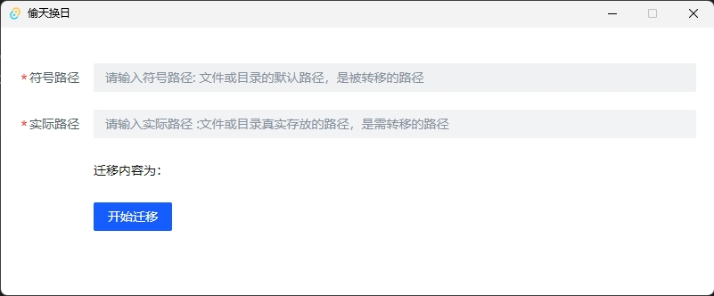

# 偷天换日

偷天换日, 将运行的文件搬到其他目录下，同时在原目录创建符号链接。即释放原路径下的存储空间，也保留了原文件路径的读写能力。

通常用在系统盘瘦身，将存放在系统判断文件移动到其它盘，系统盘创建符号链接。

运行需要 `管理员权限`

## 感谢支持

- [VS Code](https://code.visualstudio.com/) + [Volar](https://marketplace.visualstudio.com/items?itemName=Vue.volar) + [Tauri](https://marketplace.visualstudio.com/items?itemName=tauri-apps.tauri-vscode)
